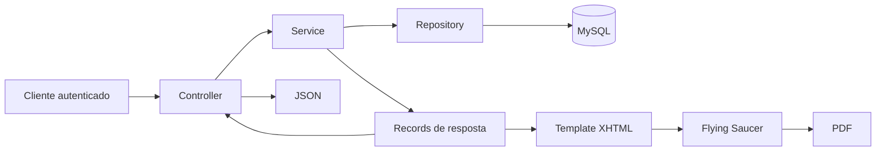

# Relatório de Progresso Calórico

## 1. Visão geral

Esta implementação adiciona ao Calorie Tracker um fluxo completo para registrar
refeições efetivamente consumidas e gerar um relatório consolidado de progresso
calórico.

O relatório pode ser obtido em dois formatos:

- JSON, para consumo por aplicações web, mobile ou integrações.
- PDF, para visualização, impressão e compartilhamento.

As duas representações utilizam exatamente a mesma regra de negócio. O PDF não
recalcula os dados: ele usa o resultado produzido pelo serviço responsável pelo
relatório JSON.

### Problema resolvido

Antes dessa implementação, as refeições existentes no sistema estavam
associadas ao planejamento de uma dieta. Não havia uma separação clara entre:

- refeição planejada;
- refeição realmente consumida;
- consumo diário;
- média semanal;
- aderência à meta;
- dias sem registros;
- tendência recente.

A solução criou um histórico próprio de consumo, preservando as refeições
planejadas e permitindo gerar indicadores confiáveis.

---

## 2. Funcionalidades implementadas

### Registro de consumo

O usuário autenticado pode registrar uma refeição consumida informando:

- data e hora;
- descrição;
- dieta relacionada, opcionalmente;
- ingredientes;
- peso consumido de cada ingrediente.

O backend calcula automaticamente as calorias de cada item e o total da
refeição.

### Consulta do histórico

O usuário pode consultar suas refeições consumidas dentro de um intervalo de
datas.

### Relatório JSON

O relatório JSON apresenta:

- período analisado;
- dieta vigente;
- meta diária de calorias;
- calorias consumidas por dia;
- quantidade de refeições por dia;
- dias sem refeição registrada;
- médias semanais;
- média geral do período;
- diferença em relação à meta;
- percentual de consumo em relação à meta;
- tendência das duas últimas janelas de sete dias.

### Relatório PDF

O mesmo relatório pode ser gerado em PDF contendo:

- identificação do usuário;
- período do relatório;
- dieta vigente;
- resumo do período;
- tendência recente;
- tabela de médias semanais;
- tabela de consumo diário;
- destaque visual para dias sem refeições;
- paginação.

### Dados para demonstração

Foi criado um script SQL que prepara:

- usuário com credenciais conhecidas;
- dieta vigente com meta de 2.000 kcal;
- macro e ingrediente;
- 28 dias de histórico;
- duas refeições por dia;
- dois dias sem refeições;
- duas janelas de sete dias que demonstram aproximação da meta.

---

## 3. Arquitetura da solução

O fluxo principal segue a arquitetura já utilizada pelo projeto:



### Responsabilidade de cada camada

| Camada | Responsabilidade |
|---|---|
| Controller | Receber a requisição, acessar o usuário autenticado e devolver a resposta HTTP |
| Service | Aplicar validações, cálculos e regras de negócio |
| Repository | Buscar e persistir dados com Spring Data JPA |
| Model | Representar as entidades persistidas |
| DTO e record | Definir contratos imutáveis de entrada e saída |
| Template XHTML | Definir a estrutura visual do PDF |
| CSS | Definir aparência, tabelas, cores e paginação |
| Flying Saucer | Converter XHTML e CSS em PDF |
| Flyway | Versionar e aplicar alterações no banco |

### Princípio importante

O `ProgressReportService` é a fonte única dos cálculos.

O endpoint JSON chama esse serviço diretamente. O serviço de PDF também chama
esse mesmo serviço e apenas transforma o resultado em XHTML. Essa decisão evita
que JSON e PDF apresentem números diferentes.

---

## 4. Separação entre planejamento e consumo

O projeto agora diferencia dois conceitos:

### Refeições planejadas

Continuam representadas pelas rotas e entidades antigas:

```text
/api/meals
```

Elas fazem parte da estrutura de uma dieta e representam o planejamento
alimentar.

### Refeições consumidas

São representadas pelo novo recurso:

```text
/api/meal-logs
```

Cada registro é um evento histórico associado diretamente ao usuário
autenticado.

Essa separação é necessária porque uma dieta pode dizer o que deveria ser
consumido, enquanto o relatório precisa saber o que foi realmente consumido.

---

## 5. Modelo de dados

### Alteração na dieta

A tabela `diets` recebeu:

```text
daily_calorie_target
```

Esse campo representa a meta diária de calorias. Ele não deve ser confundido
com `total_calories`, que continua relacionado ao total das refeições
planejadas.

### Tabela `meal_logs`

Representa uma refeição consumida.

| Campo | Descrição |
|---|---|
| `id_meal_log` | Identificador UUID |
| `user_id` | Usuário que consumiu a refeição |
| `diet_id` | Dieta relacionada, opcional |
| `consumed_at` | Data e hora do consumo |
| `description` | Descrição da refeição |
| `total_calories` | Total de calorias calculado |

Foi criado um índice composto em:

```text
(user_id, consumed_at)
```

Esse índice favorece a principal consulta do relatório: refeições de um
usuário dentro de um período.

### Tabela `meal_log_items`

Representa cada ingrediente consumido.

| Campo | Descrição |
|---|---|
| `id_meal_log_item` | Identificador UUID |
| `meal_log_id` | Refeição consumida |
| `ingredient_id` | Ingrediente utilizado |
| `weight` | Peso consumido |
| `calories` | Calorias calculadas e preservadas |

### Snapshot das calorias

As calorias são armazenadas no item no momento do registro.

Isso é importante porque o cadastro nutricional de um ingrediente pode mudar.
Se o relatório recalculasse sempre usando o valor atual, o histórico antigo
também mudaria. O snapshot mantém o relatório consistente no tempo.

### Migração

As alterações estão em:

```text
src/main/resources/db/migration/V8__add_meal_logs_and_daily_calorie_target.sql
```

A migração cria:

- coluna de meta diária;
- tabelas de consumo;
- chaves estrangeiras;
- restrições de valores não negativos;
- índices para consultas.

---

## 6. Cálculo das calorias

Cada ingrediente possui uma quantidade de calorias por 100 gramas.

A fórmula utilizada é:

```text
calorias do item = calorias por 100 g × peso consumido ÷ 100
```

Exemplo:

```text
Ingrediente: 200 kcal por 100 g
Peso consumido: 150 g

200 × 150 ÷ 100 = 300 kcal
```

O total da refeição é a soma das calorias de todos os itens:

```text
total da refeição = soma das calorias dos itens
```

Os cálculos utilizam `BigDecimal` e `RoundingMode.HALF_UP`, evitando os erros de
precisão comuns em `double`.

---

## 7. Como o relatório é calculado

### Período

Os parâmetros `from` e `to` são opcionais.

Quando não são enviados:

```text
to = data atual
from = data atual - 27 dias
```

Portanto, o período padrão contém 28 dias incluindo hoje.

Validações:

- `from` não pode ser posterior a `to`;
- `to` não pode estar no futuro;
- o período não pode ultrapassar 366 dias.

### Dieta vigente

A dieta atual é selecionada quando:

```text
initialDate <= hoje
```

e:

```text
finalDate é nula ou finalDate >= hoje
```

Quando mais de uma dieta atende à condição, a consulta prioriza a data inicial
mais recente. Além disso, o serviço de dietas passou a rejeitar períodos
sobrepostos.

### Calorias por dia

As refeições são agrupadas pela parte de data de `consumedAt`.

Para cada data são calculados:

- soma das calorias;
- quantidade de refeições;
- diferença entre consumo e meta;
- indicador de existência de registro.

Todos os dias do intervalo são criados com `LocalDate.datesUntil()`. Se não
houver refeição em uma data, o consumo é preenchido com zero.

Essa decisão é importante: ignorar dias sem registros deixaria as médias
artificialmente maiores ou menores e esconderia falhas de acompanhamento.

### Média semanal

As semanas começam na segunda-feira.

Cada dia é associado a:

```java
date.with(TemporalAdjusters.previousOrSame(DayOfWeek.MONDAY))
```

Depois, os dias são agrupados e a média é calculada:

```text
média semanal = soma do consumo diário ÷ quantidade de dias incluídos
```

Semanas parciais usam somente os dias presentes no período solicitado.

### Comparação com a meta

A média geral é:

```text
média geral = soma do consumo de todos os dias ÷ quantidade de dias
```

A diferença é:

```text
diferença = média consumida - meta diária
```

Interpretação:

- valor negativo: média abaixo da meta;
- zero: média igual à meta;
- valor positivo: média acima da meta.

O percentual apresentado é:

```text
percentual = média consumida × 100 ÷ meta
```

Exemplo:

```text
Meta: 2.000 kcal
Média: 1.900 kcal
Percentual: 95%
```

Esse percentual representa o consumo proporcional à meta. Ele não significa,
isoladamente, que o comportamento foi saudável; essa interpretação depende do
objetivo nutricional do usuário.

### Tendência

A tendência considera somente dias encerrados. O dia atual é excluído porque
ainda pode receber novas refeições.

São necessárias duas janelas completas:

```text
Janela anterior: 7 dias
Janela atual: 7 dias
Total mínimo: 14 dias encerrados
```

Para cada janela é calculada a distância absoluta até a meta:

```text
distância = valor absoluto de (média - meta)
```

Classificações:

| Status | Regra |
|---|---|
| `APPROACHING_GOAL` | A janela atual está mais próxima da meta |
| `MOVING_AWAY_FROM_GOAL` | A janela atual está mais distante da meta |
| `STABLE` | A diferença entre as distâncias é de até 25 kcal |
| `INSUFFICIENT_DATA` | Não existe meta ou não existem 14 dias encerrados |

A variação percentual entre as médias também é retornada.

### Dias sem refeições

Um dia é listado quando:

- está dentro do período;
- é anterior à data atual;
- possui zero refeições.

O dia atual não é classificado como ausente, mesmo que ainda não possua
registros.

---

## 8. Contrato JSON

O retorno é representado pelo record `ProgressReportResponse`.

Estrutura resumida:

```json
{
  "period": {
    "from": "2026-06-12",
    "to": "2026-07-09"
  },
  "currentDiet": {
    "id": "20000000-0000-0000-0000-000000000001",
    "name": "Dieta de teste - 2000 kcal",
    "dailyCalorieTarget": 2000.00,
    "initialDate": "2026-04-10",
    "finalDate": null
  },
  "dailyCalories": [
    {
      "date": "2026-07-08",
      "consumedCalories": 1980.00,
      "targetCalories": 2000.00,
      "differenceCalories": -20.00,
      "mealCount": 2,
      "registered": true
    }
  ],
  "weeklyAverages": [
    {
      "weekStart": "2026-07-06",
      "weekEnd": "2026-07-09",
      "averageCalories": 1987.50,
      "targetCalories": 2000.00,
      "adherencePercentage": 99.38
    }
  ],
  "goalComparison": {
    "targetCalories": 2000.00,
    "averageConsumedCalories": 1940.00,
    "differenceCalories": -60.00,
    "adherencePercentage": 97.00
  },
  "trend": {
    "status": "APPROACHING_GOAL",
    "previousSevenDayAverage": 2300.00,
    "currentSevenDayAverage": 2012.86,
    "variationPercentage": -12.48
  },
  "daysWithoutMeals": [
    "2026-06-16",
    "2026-06-21"
  ]
}
```

Os valores do exemplo são ilustrativos e dependem da data em que o seed for
executado.

---

## 9. Endpoints

Todas as rotas abaixo exigem JWT:

```http
Authorization: Bearer TOKEN
```

### Login

```http
POST /api/auth/login
Content-Type: application/json
```

```json
{
  "email": "progress.report@example.com",
  "password": "Test@123"
}
```

### Registrar refeição consumida

```http
POST /api/meal-logs
Content-Type: application/json
Authorization: Bearer TOKEN
```

```json
{
  "consumedAt": "2026-07-09T12:30:00",
  "description": "Almoço",
  "dietId": "20000000-0000-0000-0000-000000000001",
  "items": [
    {
      "ingredientId": "60000000-0000-0000-0000-000000000001",
      "weight": 250.00
    }
  ]
}
```

A data deve ser ajustada para não ficar no futuro.

### Consultar refeições consumidas

```http
GET /api/meal-logs?from=2026-07-01&to=2026-07-09
Authorization: Bearer TOKEN
```

### Obter relatório JSON

```http
GET /api/reports/progress?from=2026-06-12&to=2026-07-09
Authorization: Bearer TOKEN
```

Sem período:

```http
GET /api/reports/progress
Authorization: Bearer TOKEN
```

### Obter relatório PDF

```http
GET /api/reports/progress/pdf?from=2026-06-12&to=2026-07-09
Authorization: Bearer TOKEN
```

O endpoint devolve:

```http
Content-Type: application/pdf
Content-Disposition: inline; filename="relatorio-progresso-AAAA-MM-DD.pdf"
```

---

## 10. Geração do PDF

### Arquivos visuais

```text
src/main/resources/reports/progress-report.xhtml
src/main/resources/reports/progress-report.css
```

### Etapas

1. O `ReportServiceImpl` solicita os dados ao `ProgressReportService`.
2. O template XHTML é carregado do classpath.
3. O CSS é carregado e inserido dentro do XHTML.
4. Placeholders simples são substituídos pelos valores do relatório.
5. As linhas das tabelas são montadas com `StringBuilder`.
6. Textos dinâmicos são escapados para não quebrar o XHTML.
7. O `ITextRenderer` do Flying Saucer processa o documento.
8. O PDF é escrito em um `ByteArrayOutputStream`.
9. O controller devolve o array de bytes com `application/pdf`.

Trecho conceitual:

```java
var renderer = new ITextRenderer();
renderer.setDocumentFromString(html);
renderer.layout();
renderer.createPDF(outputStream);
```

### Conteúdo visual

O template apresenta:

- cabeçalho;
- metadados;
- dieta vigente;
- cartões de resumo;
- tendência;
- médias semanais;
- tabela diária;
- dias ausentes;
- número de página.

O detalhamento diário começa em uma nova página para manter a leitura
organizada.

### Tratamento de erros

Falhas ao carregar templates ou gerar o arquivo são convertidas em
`PdfReportGenerationException`, que faz parte da hierarquia de exceções de
negócio do projeto.

---

## 11. Segurança

O relatório não recebe `userId` na URL.

O controller acessa:

```java
Principal principal
```

O nome do principal contém o e-mail obtido do JWT. O serviço usa esse e-mail
para localizar o usuário.

Benefícios:

- o cliente não escolhe arbitrariamente outro usuário;
- JSON e PDF ficam associados ao token;
- consultas de consumo sempre filtram por usuário;
- uma refeição não pode ser vinculada à dieta de outro usuário.

Quando a dieta informada não pertence ao usuário autenticado, o serviço lança
`AccessDeniedException`.

---

## 12. Tecnologias utilizadas

### Java 25

Fornece os recursos modernos de linguagem e coleções usados no relatório.

### Spring Boot 4

Organiza configuração, injeção de dependências, inicialização e integração das
camadas.

### Spring Web MVC

Implementa controllers REST, parâmetros de data, respostas JSON e entrega do
PDF.

### Spring Security e JWT

Protegem os endpoints e disponibilizam a identidade autenticada por meio de
`Principal`.

### Spring Data JPA e Hibernate

Mapeiam entidades e relacionamentos, executam consultas JPQL e gerenciam
transações.

### Jakarta Validation

Valida os records de entrada:

- campos obrigatórios;
- lista de itens não vazia;
- peso positivo;
- descrição limitada a 255 caracteres.

### MySQL

Persiste usuários, dietas, ingredientes e histórico de consumo.

### Flyway

Versiona a evolução do schema por meio da migration V8.

### Flying Saucer

Converte XHTML e CSS em PDF através de `ITextRenderer`.

### OpenPDF

É utilizado internamente pela dependência `flying-saucer-pdf` para escrever o
documento PDF.

### Lombok

Reduz código repetitivo em entidades e serviços, por exemplo:

- `@Getter`;
- `@Setter`;
- `@RequiredArgsConstructor`;
- `@NoArgsConstructor`.

---

## 13. Recursos Java utilizados

### Records

Records foram usados nos contratos imutáveis:

- `MealLogRequest`;
- `MealLogItemRequest`;
- `MealLogResponse`;
- `MealLogItemResponse`;
- `MealLogCaloriesProjection`;
- `ProgressReportResponse`;
- records internos de período, dieta, dia, semana, comparação e tendência.

Vantagens:

- menos código repetitivo;
- imutabilidade;
- contrato explícito;
- serialização JSON direta;
- boa aplicação para projeções e DTOs.

### Projeção com record

O repository não carrega entidades completas para calcular o relatório. A
consulta retorna somente:

```java
public record MealLogCaloriesProjection(
        LocalDateTime consumedAt,
        BigDecimal calories) {
}
```

Isso reduz os dados transportados entre banco e aplicação.

### Stream API

Os streams são usados para:

- agrupar calorias por dia;
- contar refeições;
- gerar todos os dias do período;
- montar respostas;
- reduzir valores;
- filtrar dias sem refeições;
- agrupar semanas.

Exemplos de operações:

```java
Collectors.toMap(...)
Collectors.groupingBy(...)
Collectors.counting()
Collectors.mapping(...)
reduce(...)
filter(...)
map(...)
toList()
```

### `toList()`

Transforma o resultado de streams em listas não modificáveis e reduz a
verbosidade em comparação com `collect(Collectors.toList())`.

### `Map.of()`

É usado para:

- criar mapa imutável de configurações da tendência;
- representar mapa vazio quando não existem refeições.

### `List.of()`

Já é utilizado no fluxo de relatórios do projeto para representar coleções
vazias imutáveis sem retornar `null`.

### `SequencedCollection`

O Java 25 permite representar explicitamente uma coleção cuja ordem importa.

No relatório, a ordem cronológica é essencial para:

- médias semanais;
- seleção das últimas janelas;
- tendência.

O código usa:

```java
SequencedCollection<DailyCalories>
```

Isso comunica melhor a intenção do que uma coleção genérica sem garantia de
ordem.

### `getLast()`

A API moderna de listas é usada para obter o último dia incluído em uma semana:

```java
weekDays.getLast()
```

### `datesUntil()`

Gera todas as datas do intervalo:

```java
from.datesUntil(to.plusDays(1))
```

O `plusDays(1)` torna a data final inclusiva.

### API de datas

Foram usados:

- `LocalDate`;
- `LocalDateTime`;
- `DayOfWeek`;
- `TemporalAdjusters`;
- `DateTimeFormatter`.

### `BigDecimal`

Evita imprecisão em calorias, médias e percentuais.

Operações relevantes:

- `add`;
- `multiply`;
- `divide`;
- `subtract`;
- `abs`;
- `setScale`;
- `signum`;
- `compareTo`.

### Switch expression

A classificação interna da tendência é traduzida no PDF com switch moderno:

```java
return switch (status) {
    case "APPROACHING_GOAL" -> "Aproximando-se da meta";
    case "MOVING_AWAY_FROM_GOAL" -> "Afastando-se da meta";
    case "STABLE" -> "Estável";
    case "INSUFFICIENT_DATA" -> "Dados insuficientes";
    default -> status;
};
```

### `var`

É usado somente em variáveis locais cujo tipo é evidente, mantendo o código
conciso sem esconder contratos importantes.

### Try-with-resources

Garante fechamento de streams ao carregar templates e gerar o PDF:

```java
try (var outputStream = new ByteArrayOutputStream()) {
    // geração
}
```

### `StringBuilder`

É usado para montar tabelas e listas XHTML sem criar grande quantidade de
strings intermediárias.

---

## 14. Consultas e eficiência

### Consulta de calorias

O `MealLogRepository` utiliza JPQL com projeção:

```java
select new com.calorietracker.projections.MealLogCaloriesProjection(
    m.consumedAt,
    m.totalCalories
)
from MealLogModel m
where m.user.idUser = :userId
  and m.consumedAt >= :from
  and m.consumedAt < :to
order by m.consumedAt
```

O limite superior é exclusivo:

```text
from.atStartOfDay()
to.plusDays(1).atStartOfDay()
```

Isso inclui todo o último dia sem depender de `23:59:59.999`.

### Consulta da dieta vigente

A consulta considera datas nulas como períodos abertos e ordena pela data
inicial mais recente.

### `@EntityGraph`

Na consulta detalhada de refeições consumidas, `@EntityGraph` carrega dieta,
itens e ingredientes necessários à resposta, reduzindo consultas adicionais
por lazy loading.

### Transações somente leitura

Consultas e relatórios usam:

```java
@Transactional(readOnly = true)
```

Isso expressa a intenção da operação e permite otimizações do provedor de
persistência.

---

## 15. Script de demonstração

Arquivo:

```text
src/main/resources/db/testdata/progress-report-seed.sql
```

### Execução no DBeaver

1. Conectar ao banco `calorieTracker`.
2. Confirmar que as migrations foram executadas até V8.
3. Abrir o arquivo SQL.
4. Usar **Executar script SQL**.
5. No atalho padrão, usar `Alt+X`.
6. Não enviar todo o conteúdo como uma única instrução JDBC.

O script utiliza `UNHEX(REPLACE(...))` para converter UUID em `BINARY(16)`,
evitando dependência de `UUID_TO_BIN`.

### Credenciais

```text
E-mail: progress.report@example.com
Senha: Test@123
```

### Comportamento esperado

Após a execução:

- a consulta final mostra duas refeições nos dias registrados;
- existem dois dias ausentes;
- a dieta vigente possui meta de 2.000 kcal;
- a tendência deve indicar aproximação da meta.

---

## 16. Roteiro de demonstração prática

### Passo 1 — Preparar os dados

Execute o seed no DBeaver.

Fala sugerida:

> Primeiro eu preparo um cenário controlado com uma dieta de 2.000 calorias,
> refeições em 28 dias, dois dias sem registros e uma melhora nas duas últimas
> semanas. Assim consigo demonstrar todos os campos do relatório.

### Passo 2 — Iniciar a aplicação

```bash
./mvnw spring-boot:run
```

### Passo 3 — Fazer login

```bash
curl -X POST http://localhost:8080/api/auth/login \
  -H "Content-Type: application/json" \
  -d '{
    "email": "progress.report@example.com",
    "password": "Test@123"
  }'
```

Copie o token retornado.

Fala sugerida:

> O usuário é identificado pelo JWT. O endpoint não recebe um identificador de
> usuário, reduzindo o risco de consultar dados de outra pessoa.

### Passo 4 — Exibir o JSON

```bash
curl "http://localhost:8080/api/reports/progress" \
  -H "Authorization: Bearer SEU_TOKEN"
```

Mostre:

1. `currentDiet`;
2. `dailyCalories`;
3. `weeklyAverages`;
4. `goalComparison`;
5. `trend`;
6. `daysWithoutMeals`.

Fala sugerida:

> O relatório inclui inclusive os dias zerados. Isso impede que a média ignore
> dias sem acompanhamento. O dia atual não é marcado como ausente porque ainda
> pode receber registros.

### Passo 5 — Exibir o PDF

```bash
curl "http://localhost:8080/api/reports/progress/pdf" \
  -H "Authorization: Bearer SEU_TOKEN" \
  --output relatorio-progresso.pdf
```

Fala sugerida:

> O PDF não possui uma segunda implementação dos cálculos. Ele usa o mesmo
> objeto consolidado do JSON e apenas transforma os dados em XHTML e CSS antes
> da conversão pelo Flying Saucer.

### Passo 6 — Registrar nova refeição

Envie um `POST /api/meal-logs` com uma data válida.

Depois, gere novamente o JSON e o PDF.

Fala sugerida:

> Ao registrar uma refeição, o backend calcula as calorias por ingrediente,
> preserva esses valores no histórico e o relatório seguinte já reflete a
> alteração.

---

## 17. Roteiro de apresentação oral

### Abertura — 1 minuto

> O objetivo desta entrega foi transformar dados isolados de refeições em um
> acompanhamento útil. Para isso, foi necessário separar planejamento de
> consumo real e consolidar os registros em indicadores diários, semanais e de
> tendência.

### Problema e decisão de modelagem — 2 minutos

Explique:

- refeições antigas representam planejamento;
- consumo real precisa de data, usuário e histórico;
- foi criado `meal_logs`;
- as calorias foram armazenadas como snapshot;
- a dieta recebeu uma meta diária própria.

### Fluxo técnico — 2 minutos

Apresente:

```text
JWT → Controller → Service → Repository → MySQL
                              ↓
                    ProgressReportResponse
                       ↙             ↘
                    JSON         XHTML → PDF
```

Reforce que existe uma única fonte para os cálculos.

### Recursos Java — 2 minutos

Destaque:

- records;
- projeção com record;
- streams e collectors;
- `datesUntil`;
- `toList`;
- `Map.of`;
- `SequencedCollection`;
- `getLast`;
- `BigDecimal`;
- switch expression;
- try-with-resources.

### Regras de negócio — 2 minutos

Explique:

- período padrão de 28 dias;
- dias sem refeições entram como zero;
- semanas começam na segunda-feira;
- tendência compara duas janelas de sete dias;
- dia atual é excluído da ausência e da tendência;
- período máximo de 366 dias.

### PDF e encerramento — 1 minuto

> O resultado pode ser integrado por JSON ou apresentado em PDF. O Flying
> Saucer converte um template XHTML com CSS, permitindo manter a parte visual
> separada das regras de negócio. Dessa forma, a solução é reutilizável,
> auditável e pode evoluir sem duplicar cálculos.

---

## 18. Perguntas que podem surgir

### Por que não reutilizar a entidade de refeições existente?

Porque ela participa do planejamento da dieta. Misturar planejamento e consumo
real tornaria o total da dieta dependente do histórico e impediria uma
comparação confiável com a meta.

### Por que armazenar as calorias no item?

Para preservar o histórico. Se as calorias do ingrediente forem atualizadas,
refeições antigas continuam com o valor conhecido no momento do consumo.

### Por que dias sem refeição entram com zero?

Porque o relatório mede o período completo. Remover esses dias faria a média
considerar somente os dias em que o usuário registrou algo.

### Por que o dia atual não é considerado ausente?

Porque o dia ainda não terminou e pode receber novas refeições.

### Por que são necessárias duas semanas para a tendência?

Uma tendência exige comparação. Uma janela representa o comportamento anterior
e a outra representa o comportamento mais recente.

### O PDF calcula os dados novamente?

Não. Ele usa o mesmo `ProgressReportResponse` retornado pelo serviço do JSON.

### Por que usar `BigDecimal`?

Porque calorias e percentuais exigem arredondamento previsível. `double` pode
introduzir erros binários de precisão.

### Como os dados de outro usuário são protegidos?

O e-mail vem do JWT e todas as consultas do novo fluxo filtram pelo usuário
autenticado.

---

## 19. Arquivos principais

### Consumo

```text
src/main/java/com/calorietracker/controllers/MealLogController.java
src/main/java/com/calorietracker/services/MealLogService.java
src/main/java/com/calorietracker/services/impl/MealLogServiceImpl.java
src/main/java/com/calorietracker/repositories/MealLogRepository.java
src/main/java/com/calorietracker/models/MealLogModel.java
src/main/java/com/calorietracker/models/MealLogItemModel.java
```

### Relatório

```text
src/main/java/com/calorietracker/controllers/ReportController.java
src/main/java/com/calorietracker/services/ProgressReportService.java
src/main/java/com/calorietracker/services/impl/ProgressReportServiceImpl.java
src/main/java/com/calorietracker/dtos/report/ProgressReportResponse.java
src/main/java/com/calorietracker/projections/MealLogCaloriesProjection.java
```

### PDF

```text
src/main/java/com/calorietracker/services/ReportService.java
src/main/java/com/calorietracker/services/impl/ReportServiceImpl.java
src/main/resources/reports/progress-report.xhtml
src/main/resources/reports/progress-report.css
```

### Banco e demonstração

```text
src/main/resources/db/migration/V8__add_meal_logs_and_daily_calorie_target.sql
src/main/resources/db/testdata/progress-report-seed.sql
```

---

## 20. Validações realizadas

Durante a implementação foram verificados:

- compilação limpa dos fontes Java;
- mapeamentos gerados pelo MapStruct;
- estrutura XHTML com parser XML;
- renderização real do template pelo Flying Saucer;
- geração de arquivo PDF válido;
- hash BCrypt do usuário de demonstração;
- consistência de whitespace com `git diff --check`.

Os testes unitários não foram adicionados porque foram explicitamente
dispensados no escopo solicitado.

---

## 21. Limitações e possíveis evoluções

### Meta histórica

Atualmente, a meta da dieta vigente na data de geração é aplicada ao período
inteiro. Uma evolução seria localizar a dieta vigente em cada dia, permitindo
comparar períodos que atravessam mudanças de dieta.

### Fuso horário

Os cálculos usam `LocalDate.now()` e o fuso horário do servidor. Uma evolução
seria armazenar o fuso do usuário e injetar um `Clock`.

### Gráficos

O PDF usa tabelas. Uma evolução possível é gerar gráficos de linha ou barras e
incorporá-los ao XHTML.

### Tipagem da tendência

Os status são strings. Eles podem evoluir para um `enum`, reduzindo risco de
valores inválidos.

### Testes automatizados

Casos recomendados:

- período inválido;
- período superior a 366 dias;
- ausência de dieta;
- ausência de meta;
- dias sem refeições;
- semana parcial;
- tendência estável;
- aproximação da meta;
- afastamento da meta;
- isolamento entre usuários;
- contrato JSON;
- resposta PDF.

### Dietas antigas

Dietas criadas antes da migration V8 podem possuir
`daily_calorie_target = null`. Elas devem ser atualizadas para habilitar
comparação e tendência.

---

## 22. Resumo para encerramento

A implementação entregou:

- separação entre refeição planejada e consumida;
- persistência histórica segura;
- cálculo automático de calorias;
- meta diária por dieta;
- consolidação diária e semanal;
- comparação com meta;
- tendência recente;
- detecção de dias sem registros;
- resposta JSON estruturada;
- relatório PDF com Flying Saucer;
- autenticação por JWT;
- migration Flyway;
- seed de demonstração;
- uso de recursos modernos do Java 25.

Mensagem final sugerida:

> O relatório transforma registros de consumo em informação prática. A
> arquitetura mantém cálculo, persistência e apresentação separados, reutiliza
> a mesma regra para JSON e PDF e deixa uma base clara para evoluções como
> metas históricas, gráficos e análises nutricionais mais avançadas.
